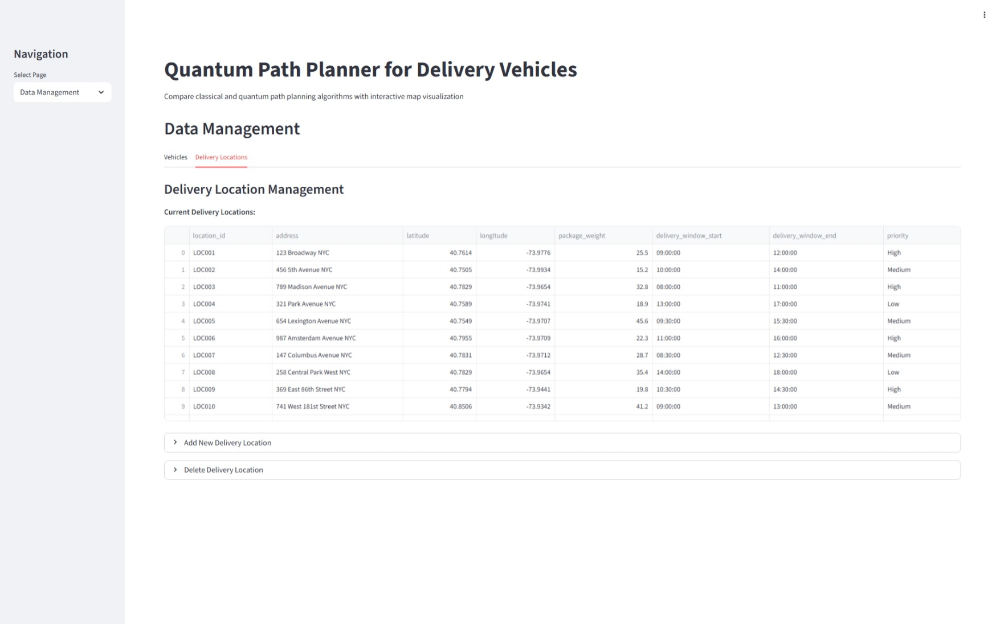

# 🚚 Quantum Path Planner for Delivery Vehicles

An intelligent path optimization system that leverages **quantum computing techniques** to find the most efficient delivery routes for vehicles.  

---

## ✨ Features
- ⚡ Quantum-inspired algorithms for path optimization  
- 🚗 Multi-vehicle and multi-destination support  
- 📉 Minimization of cost, distance, and delivery time  
- 🔀 Hybrid classical–quantum approach for better scalability  
- 📊 Visualizations for optimized delivery paths  

---

## 🖼️ Screenshots

### 🛣️ Route Planning

### 🗺️ Map Visualization

### Perfomance Dashboard 

### 📂 Data Management

---

## 🛠️ Tech Stack
- **Python**  
- **Qiskit / D-Wave / PennyLane** (Quantum framework — IBM QISKIT)  
- **NumPy, SciPy, Pandas** (Data handling & optimization)  
- **Matplotlib, Seaborn** (Visualization)  
